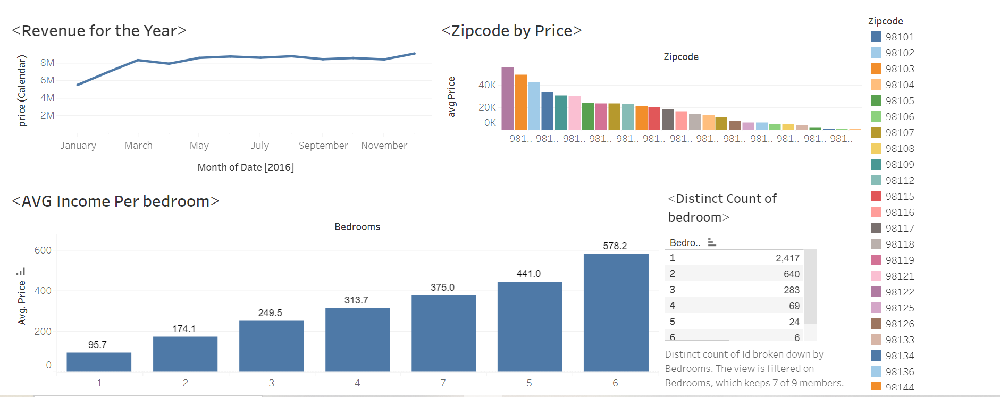

# Airbnb Listings Data Visualization

This Tableau visualization project aims to provide insights into Airbnb listings data. The visualization showcases various aspects of Airbnb listings such as pricing trends, property types, geographical distribution, and more.
## Dashboard image

## Getting Started

To view the visualization, follow these steps:

1. Ensure you have Tableau Desktop installed on your system.
2. Download the Tableau workbook file (`Airbnb_Listings_Visualization.twbx`) from this repository.
3. Open Tableau Desktop.
4. Navigate to `File` > `Open` and select the downloaded `.twbx` file.
5. Explore the various sheets and dashboards to interact with the data.

## Data Source

The data used for this visualization was sourced from the Airbnb Inside website.[HERE]https://www.kaggle.com/datasets/alexanderfreberg/airbnb-listings-2016-dataset It includes information about Airbnb listings in various cities worldwide, including details such as price, property type, location, and more.

## Overview of Visualization

The visualization consists of several sheets and dashboards, each focusing on different aspects of Airbnb listings data:

- **Pricing Trends:** Explore the trends in listing prices over time and across different property types.
- **Geographical Distribution:** Visualize the geographical distribution of Airbnb listings on a map.
- **Property Types:** Analyze the distribution of different types of properties available on Airbnb.
- **Reviews Analysis:** Examine the relationship between listing reviews and pricing.

## Additional Notes

- **Filters:** You can use filters provided in each dashboard to refine your analysis based on various criteria such as location, price range, property type, etc.
- **Interactivity:** Feel free to interact with the visualizations by clicking on different data points, selecting filters, or hovering over elements to view tooltips.

## Feedback and Contributions

Your feedback is valuable! If you have any suggestions for improving the visualization or if you encounter any issues, please create an issue in this repository.

If you'd like to contribute to this project by adding new visualizations or enhancing existing ones, feel free to submit a pull request.

